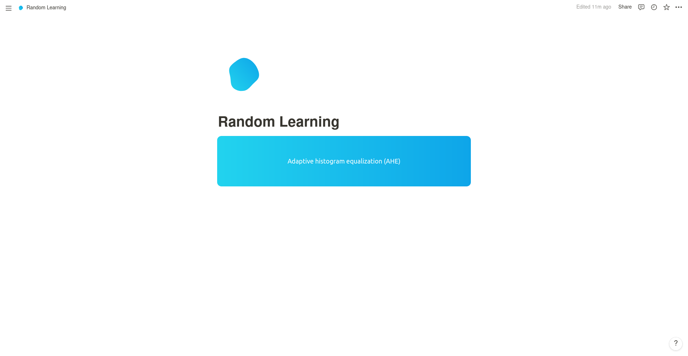

This is a very small project that aims to embed into Notion.so. Its goal is to randomly pick a page from a database, like a flashcard tool 🪧



# How to deploy

Before, you need to create an integration to get an Notion API key. To this follow [the documentation](https://developers.notion.com/docs/getting-started)

Now you have to link the database where you want to get the informations from and your new integration. To this, go to your database page in Notion, click on "..." then click on "Add connections" and choose your integration

And since you are on Notion get the id of your database from the url:
```
https://www.notion.so/myworkspace/a8aec43384f447ed84390e8e42c2e089?v=...
                                  |--------- Database ID --------|
```

You are ready to deploy it :

1. Fork it
2. Go to [Vercel.com](http://vercel.com)
3. Create new project
4. Select this repo
5. Choose Next.js for the techo
6. Create the env variable NOTION_API_TOKEN that contains your integration secret token
7. Create the env variable NOTION_DATABASE that contains your database ID
8. Click on "Deploy"

Well done 🚀
